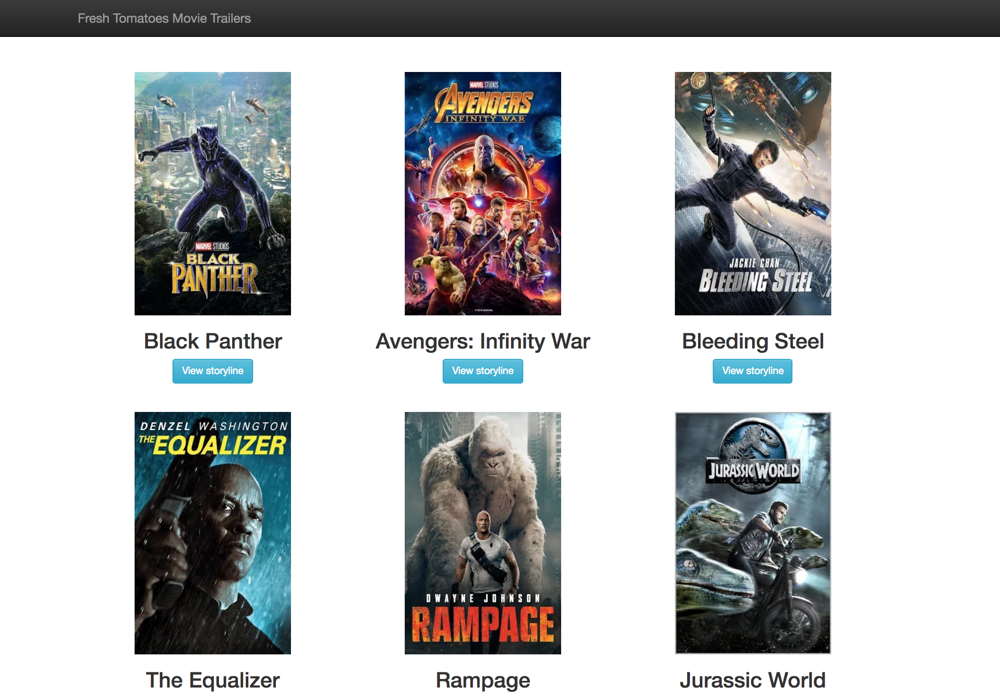

# Movie trailer website project
> a simple website

Udacity fullstack nanodegree project #1



## Development setup
Python 2.7

## Modifications
* Added `<button>`s in `fresh_tomatoes.py` html section.
* Added additional javascript to enable `View storyline` button interaction.
* Minor changes to css and existing jQuery event handlers.

## Instruction
In the project directory, run
```sh
python entertainment_center.py
```
